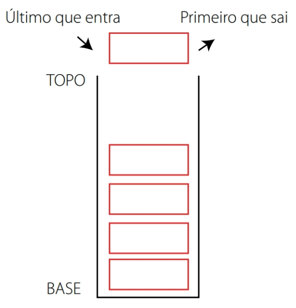

# Operações

As pilhas estão presentes em diversos algoritmos computacionais, principalmente nos que dizem respeito a rotinas do Sistema operacional, não sendo menos importantes a sua utilização em procedimentos e funções de programas. Como na realidade os programas são divididos em rotinas menores, os procedimentos e as funções, que recebem chamadas de execução do programa principal, é necessário que haja um mecanismo para controlar o fluxo de execução de cada uma dessas rotinas chamadas durante o tempo de execução do programas, e é aí que entram as pilhas.

As pilhas são as mais simples de todas as estruturas de dados, mas também estão entre as mais importantes. Eles são usados em uma série de aplicativos diferentes e como uma ferramenta para muitos algoritmos e estruturas de dados mais sofisticados. 

Formalmente, uma pilha é um tipo abstrato de dados \(ADT\) de forma que uma instância S suporte os dois métodos a seguir: 

`push(e): Adicione o elemento e ao topo da pilha S.` 

`pop(): Remove e retorna o elemento do topo da pilha S; ocorre um erro se a pilha estiver vazia.` 

Além disso, vamos definir os seguintes métodos de acesso por conveniência: 

`top(): Retorna uma referência ao elemento superior da pilha S, sem removê-lo; ocorre um erro se a pilha estiver vazia.` 

`is_empty(): Retorna True se a pilha S não contém nenhum elemento.` 

`__len__(S): Retorna o número de elementos na pilha S; em Python, nós implemente isso com o método especial __len__.`

Uma etapa fundamental para entender tal estrutura é explorar as operações principais da mesma. Entre elas destacaremos:

* Criação de uma pilha;
* Verificar se pilha está vazia;
* Inserção de elementos em uma pilha;
* Remoção de elementos em uma pilha;
* Impressão dos valores da pilha;
* Busca do elemento do topo;
* Tamanho da pilha.

