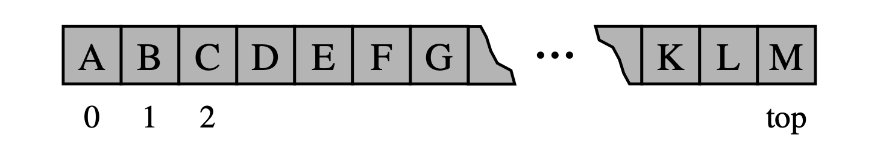

# Criação de Pilhas

Podemos implementar uma pilha com bastante facilidade, armazenando seus elementos em uma lista Python. 

Uma lista já suporta adicionar um elemento ao final com o método _append_ e remover o último elemento com o método _pop_, por isso é natural alinhar o topo da pilha no final da lista, conforme mostrado na Figura a seguir:



Para criarmos uma pilha o primeiro passo é criar uma classe Pilha, pois ela é um elemento fundamental dessa nossa explicação:

```text
class Pilha:


```

Em um segundo momento, é necessário criar uma pilha vazia. Para isto, usaremos uma lista para nos ajudar nessa tarefa. A lista armazenará os conteúdos salvos pela pilha.

É importante perceber que a lista que utilizaremos precisa ser uma informação encapsulada, por isso precisamos nomear a lista como self.\_\_nomeQualquer ... Finja que isso é uma regra, em breve entenderemos com profundidade deste aspecto. 

```text
class Pilha:
    def __init__(self):
        self.__dados = []

```

Para utilizar essa Pilha podemos fazer de duas formas:

1\) Em um mesmo arquivo .py:

```text
class Pilha:
    def __init__(self):
        self.__dados = []        

def main():
    pilhaTeste = Pilha()

main()
```

2\) Trabalhando com dois arquivos .py \(maioria dos casos\):

```text
#pilha.py

class Pilha:
    def __init__(self):
        self.__dados = []  
```

```text
#teste.py

from pilha import Pilha 

pilhaTeste = Pilha()
```

### Verificando se a pilha está vazia

Para verificar se a pilha está vazia, implemente o método is\_empty\(\):

```text
class Pilha:
    def __init__(self):
        self.__dados = []   
        
    #retorna True se for vazia
    def is_empty(self):
      return len(self.__dados) == 0
```


