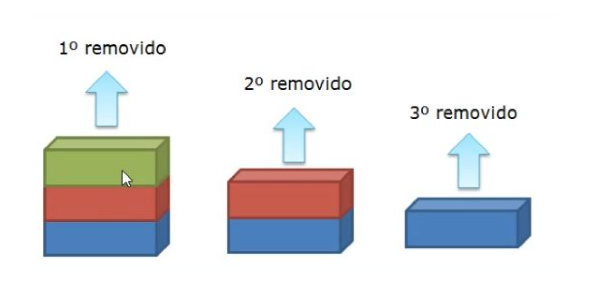

# Remoção de elementos

A Figura a seguir ilustra como deve ser a remoção de elementos em uma pilha. Percebam que remoção deve ser realizada no topo da estrutura, assim como fazemos com as moedas mencionadas no começo dessa conversa.



Em código, para remover um elemento da pilha devemos retirá-lo do topo sempre. Para isto, criaremos uma função denominada POP que não tem parâmetro.

```text
class Pilha:
    def __init__(self):
        self.__dados = []
    
    #retorna True se for vazia
    def is_empty(self):
      return len(self.__dados) == 0

    def push(self, novoElem):
        self.__dados.append(novoElem)

    def pop(self):
        if self.is_empty():
            return "Lista Vazia - Não houve Remoção"
        return self.__dados.pop()
```

Como testaremos?

1\) No mesmo .py:

```text
class Pilha:
    def __init__(self):
        self.__dados = []
    
    #retorna True se for vazia
    def is_empty(self):
      return len(self.__dados) == 0
    
    def push(self, novoElem): 
        self.__dados.append(novoElem)

    def pop(self):
        if self.is_empty():
            return "Lista Vazia - Não houve Remoção"
        return self.__dados.pop()

def main():
    pilhaTeste = Pilha()
    pilha.push("elemento 1")
    pilha.push("elemento 2")
    pilha.pop()

main()
```

2\) Utilizando dois arquivos .py

```text
#pilha.py

class Pilha:
    def __init__(self):
        self.__dados = []
        
    #retorna True se for vazia
    def is_empty(self):
      return len(self.__dados) == 0
    
    def push(self, novoElem): 
        self.__dados.append(novoElem)

    def pop(self):
        if self.is_empty():
            return "Lista Vazia - Não houve Remoção"
        return self.__dados.pop()
```

```text
#teste.py

from pilha import Pilha

def main():
    pilhaTeste = Pilha()
    pilha.push("elemento 1")
    pilha.push("elemento 2")
    pilha.pop()

main()
```

