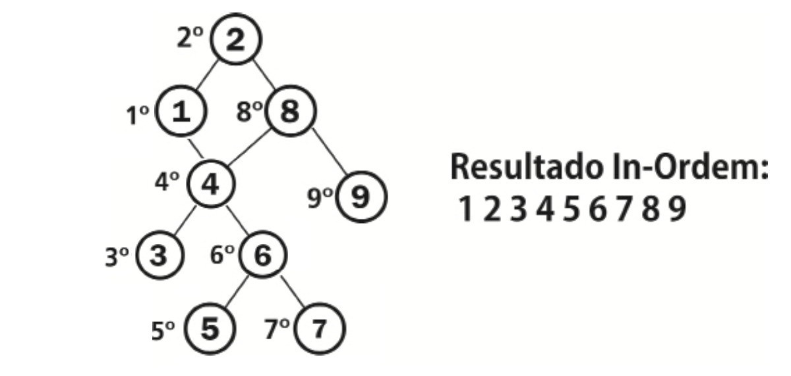
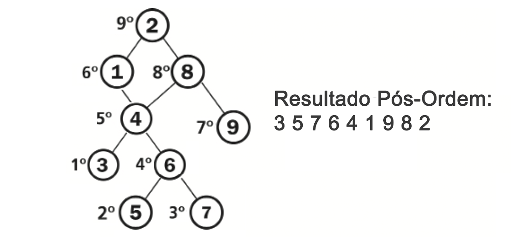

# Árvores Binárias

## Árvores Binárias

### Estrutura de uma árvore binária

Uma árvore binária é uma estrutura de dados bidimensional, com propriedades especiais:

* O nó-raiz é o primeiro nó da árvore. Cada ligação no nó-raiz referencia um filho.
* Os nós de uma árvore binária contêm, no máximo, duas ligações: o filho esquerdo e o filho direito.
* O filho esquerdo é o primeiro nó na subárvore esquerda \(também conhecido como o nó raiz da subárvore esquerda\). E o filho direito é o primeiro nó na subárvore direita \(também conhecido como o nó raiz da subárvore direita\).
* O nó sem filhos é chamado de nó folha.


### **Implementação de Árvores Binárias**

Para implementar uma árvore binaria, é preciso primeiramente criar a estrutura que irá conter cada nó que compõe a árvore, o que será chamado de `No`. O nó da árvore segue a mesma ideia do nó da lista encadeada, com a diferença de que ao invés de ter o apontamento apenas para o próximo elemento, há o apontamento para os nós da esquerda e da direita. 

```text
class No:
  def __init__(self, carga: object, esquerda: 'No' = None, direita: 'No' = None):
    self.carga = carga
    self.esquerda = esquerda
    self.direita = direita

  def __str__(self):
    return self.carga
```

Uma vez que foi criada a classe`No`, é preciso criar a classe `ArvoreBinaria` , que irá conter apenas a referência para o nó raiz. Esta classe irá conter também posteriormente os métodos que realizam operações na árvore, como navegação, inserção, balanceamento, remoção, etc.

```text
class ArvoreBinaria:
  def __init__(self, raiz: 'No'):
    self.raiz = raiz
```

### Percurso em árvores binárias

O percurso em uma árvore binária é a ordem com que todos os seus nós são visitados. Vamos considerar os seguintes percursos:

• Pré-ordem;

• In-ordem;

• Pós-ordem.

Os percursos em árvores utilizam a técnica de recursividade nos algoritmos. A recursividade é originada quando uma função chama a si própria.

#### Travessia em pré-ordem:

Os seguintes passos devem ser executados para se percorrer os nós da árvore:

a\) se árvore vazia, fim;  
b\) exibir a informação do nó;  
c\) percorrer em pré-ordem a subárvore esquerda \(recursivamente\);   
d\) percorrer em pré-ordem a subárvore direita \(recursivamente\).


```text
  def pre_ordem(self, no: 'No' = None):
    if no is None:
      return no
    print(no)
    if no.esquerda:
      self.pre_ordem(no.esquerda)
    if no.direita:
      self.pre_ordem(no.direita)
```

#### Travessia em in-ordem:

a\) se árvore vazia, fim;   
b\) percorrer em pré-ordem a subárvore esquerda \(recursivamente\);   
c\) exibir a informação do nó;   
d\) percorrer em pré-ordem a subárvore direita \(recursivamente\).



```text
  def in_ordem(self, no: 'No' = None):
    if no is None:
      return no
    if no.esquerda:
      self.in_ordem(no.esquerda)
    print(no)
    if no.direita:
      self.in_ordem(no.direita)
```

#### Travessia em pós-ordem

a\) se árvore vazia, fim;  
b\) percorrer em pré-ordem a subárvore esquerda \(recursivamente\);   
c\) percorrer em pré-ordem a subárvore direita \(recursivamente\); e   
d\) exibir a informação do nó.



```text
  def pos_ordem(self, no: 'No' = None):
    if no is None:
      return no
    if no.esquerda:
      self.pos_ordem(no.esquerda)
    if no.direita:
      self.pos_ordem(no.direita)
    print(no)
```

#### 

