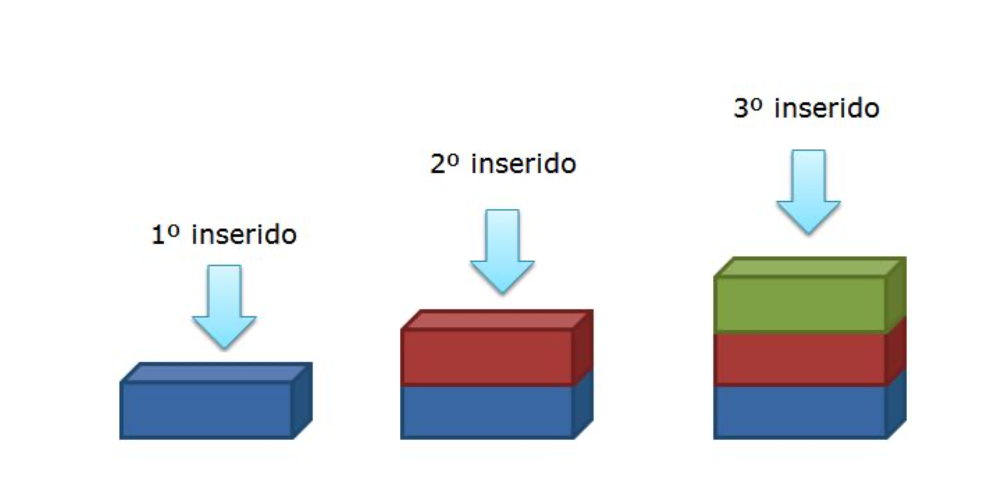

# Inserção de elementos

Inicialmente, é importante entender o funcionamento de uma pilha.

A Figura a seguir ilustra como deve ser o armazenamento dos novos dados em uma pilha. Percebam que todo novo elemento inserido \(pode ser de qualquer tipo de dado\) é SEMPRE adicionado no topo da estrutura, assim como fazemos com as moedas mencionadas no começo dessa conversa \(Como estamos trabalhando com lista o topo representa o final da lista\).



Em código, para adicionarmos um novo elemento devemos adicionar elementos na lista que foi inicializada na pilha. Para isto, criaremos uma função denominada PUSH que recebe como parâmetro o elemento que precisa ser adicionado à pilha. A lógica para inserção é a mesma utilizada para inserir no início em listas encadeadas. O novo nó deve apontar para o topo atual como próximo e em seguida se tornará o topo.

```text
class Pilha:
  def __init__(self):
    self.topo = None

  def is_empty(self):
    return self.topo is None

  def push(self, elemento):
    no = No(elemento)
    no.anterior = self.topo
    self.topo = no
```

Como devemos testar?

```text
#pilha.py

from pilha import Pilha 

def main():
    pilhaTeste = Pilha()
    pilha.push("elemento 1)

main()
```


