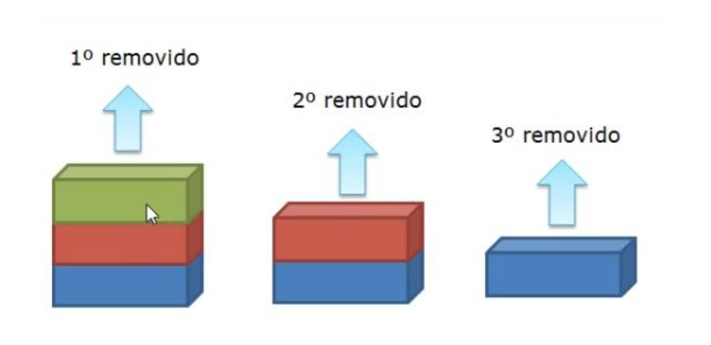

# Remoção de elementos

A Figura a seguir ilustra como deve ser a remoção de elementos em uma pilha. Percebam que remoção deve ser realizada no topo da estrutura, assim como fazemos com as moedas mencionadas no começo dessa conversa.



Em código, para remover um elemento da pilha devemos retirá-lo do topo sempre. Para isto, criaremos uma função denominada POP que não tem parâmetro.

```text
class Pilha:
  def __init__(self):
    self.topo = None

  def is_empty(self):
    return self.topo is None

  def push(self, elemento):
    no = No(elemento)
    no.anterior = self.topo
    self.topo = no

  def pop(self):
    assert self.topo != None, "Impossível remover elemento de pilha vazia."
    self.topo = self.topo.anterior
```

Como testaremos?

```text
from pilha import Pilha

def main():
    pilhaTeste = Pilha()
    pilha.push("elemento 1")
    pilha.push("elemento 2")
    pilha.pop()

main()
```

