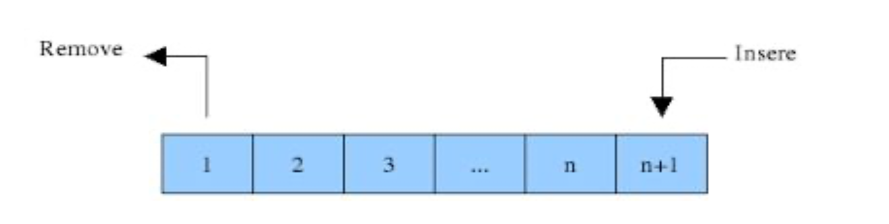

# Criação das Filas

Podemos implementar uma fila com bastante facilidade, armazenando seus elementos em uma lista Python. 

Uma lista já suporta adicionar um elemento ao final com o método _append_ e remover o último elemento com o método _pop_, por isso é natural alinhar o topo da pilha no final da lista, conforme mostrado na Figura a seguir:



Para criarmos uma fila, o primeiro passo é criar uma classe Fila, pois ela é um elemento fundamental dessa nossa explicação:

```text
class Fila:

```

Em um segundo momento, é necessário criar uma fila vazia. Para isto, usaremos uma lista para nos ajudar nessa tarefa. A lista armazenará os conteúdos salvos pela pilha.

É importante perceber que a lista que utilizaremos precisa ser uma informação encapsulada, por isso precisamos nomear a lista como self.\_\_nomeQualquer ... Novamente, finja que isso é uma regra, em breve entenderemos com profundidade deste aspecto. 

```text
class Fila:
    def __init__(self):
        print("__init__")
        self.__dados = []
```

Para utilizar essa Fila podemos fazer de duas formas:

1\) Em um mesmo arquivo .py:

```text
class Fila:
    def __init__(self):
        print("__init__")
        self.__dados = []


def main():
    fila_teste = Fila()
    
main()
```

 2\) Trabalhando com dois arquivos .py \(maioria dos casos\):

```text
#arquivo fila.py
class Fila:
    def __init__(self):
        print("__init__")
        self.__dados = []

```

```text
#arquivo teste.py
from fila import Fila

fila_teste = Fila()
```

## Verificando se a fila está vazia

Para verificar se a fila está vazia, implemente o método is\_empty\(\):

```text
class Fila:
    def __init__(self):
        print("__init__")
        self.__dados = []
    
    def is_empty(self):
        return len(self.__dados) == 0
```

