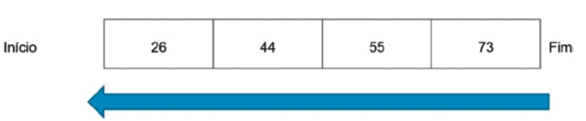
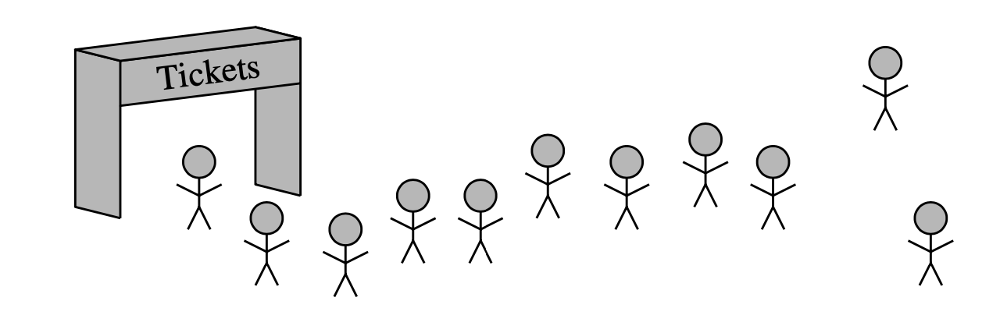

# Visão Geral

Existem algumas bibliotecas prontas que podemos usar para implementar filas, mas faremos isso de maneira manual para entender seu comportamentos \(se ficarem curiosos, olhem [https://docs.python.org/3/library/queue.html](https://docs.python.org/3/library/queue.html) \) 

Outra estrutura de dados fundamental é a fila. É uma “prima” próxima das pilhas, pois a fila é uma coleção de objetos que são inseridos e removidos de acordo com o princípio do primeiro a entrar, primeiro a sair \(FIFO - First In First Out\). Ou seja, os elementos podem ser inseridos a qualquer momento, mas apenas o elemento que está na fila há mais tempo pode ser removido em seguida. Costumamos dizer que os elementos entram em uma fila na parte de trás e são removidos pela frente. 

Uma metáfora para essa terminologia é uma fila de pessoas esperando para comprar um ingresso para o cinema. As pessoas que também querem devem esperar no final da fila a sua vez e quem está na no início da fila será o primeiro a ser atendido na bilheteria do cinema.

Existem muitas outras aplicações de filas. Lojas, teatros, centros de reserva e outros serviços semelhantes que normalmente processam solicitações de clientes de acordo com o princípio FIFO. Uma fila, portanto, seria uma escolha lógica para uma estrutura de dados para lidar com chamadas para um centro de atendimento ao cliente ou uma lista de espera em um restaurante. Filas FIFO também são usadas por muitos dispositivos de computação, como uma impressora em rede ou um servidor da Web respondendo a solicitações.

