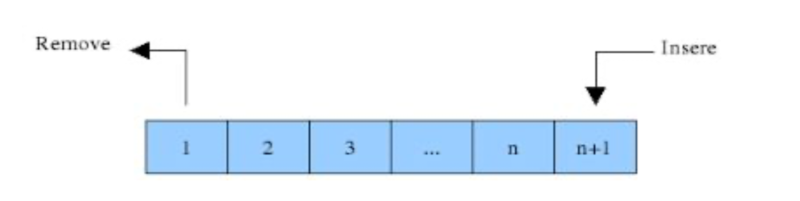

# Criação das Filas

Em filas, inserções ocorrem no final e remoções ocorrem no começo. Para isso, usaremos dois ponteiros: um para o começo da fila, e outro para o final. Esses ponteiros nos permitirão implementar inserções e remoções com custo constante.



Para criarmos uma fila, o primeiro passo é criar uma classe Fila, pois ela é um elemento fundamental dessa nossa explicação. Como usaremos a estrutura encadeada, também é necessário implementar a classe Nó, que representa cada elemento da fila.

```text
class No:
  def __init__(self, carga=0, proximo=None):
    self.carga = carga
    self.proximo = proximo

  def __repr__(self):
    return '%s -> %s' % (self.carga, self.proximo)
        
class Fila:
  def __init__(self, cabeca=None, cauda=None):
    self.cabeca = cabeca
    self.cauda = cauda

```

Note que o método `__init__` atribui o valor `None` inicialmente à cabeça e a à cauda da lista.

## Verificando se a fila está vazia

Para verificar se a fila está vazia, implemente o método is\_empty\(\) verificando se há algum valor atribuído à cabeça da lista.

```text
class Fila:
  def __init__(self, cabeca=None, cauda=None):
    self.cabeca = cabeca
    self.cauda = cauda

  def vazia(self):
    return self.cabeca is None
```

