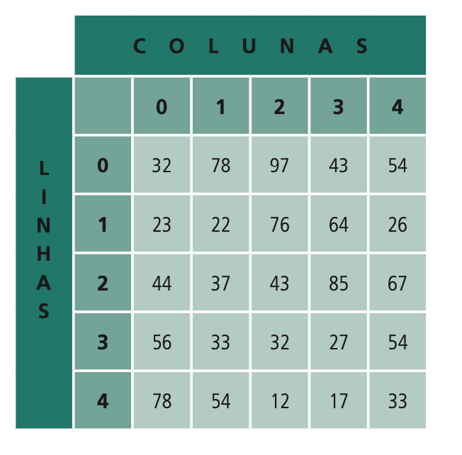

# Matrizes

Matrizes são arranjos que podem possuir várias dimensões. Um quadrado desenhado em uma folha possui duas dimensões: largura e altura. Quando desenhamos um cubo, acrescentamos outra dimensão, a profundidade. Um vetor, por ser representado em uma “linha”, é uma matriz de uma dimensão. Matrizes de duas dimensões, ou mais, possuem propriedades semelhantes a um vetor. A diferença é que devemos utilizar um maior número de índices para acessar um elemento, isto é, em uma matriz de duas dimensões \(bidimensional – podemos associar ao quadrado\) temos um índice para a base e outro para a altura.

Por convenção, o primeiro índice de uma matriz bidimensional \(primeira dimensão\), é nomeado como “linha”, enquanto o segundo índice \(segunda dimensão\) corresponde à “coluna” onde serão armazenados os elementos.

Podemos comparar uma matriz bidimensional a um arquivo com gavetas, uma das dimensões representaria o número de cada gaveta, a outra dimensão representaria o número das pastas contidas em cada gaveta.


Por convenção, costumamos representar os índices de uma matriz por letras, o “i” para linha, o “j” para coluna. Logo, a representação genérica de um índice de um elemento em uma matriz bidimensional seria `[i, j]`.


Exemplo de uma matriz bidimensional de cinco linhas e cinco colunas:



Para podermos acessar o valor `22`, localizamos o índice que será formado pela junção da linha “i” com a coluna “j”, i = 1 e j = 1, deste modo seu índice é `[1,1]`. O valor 54, por exemplo, será `[0, 4]`.

Assim como os vetores, as matrizes têm o índice de cada linha, coluna ou qualquer outra dimensão iniciados com o valor 0 \(zero\). Por exemplo, o elemento posicionado na primeira linha \(i=0\) e na primeira coluna \(j=0\) da matriz terá índice \[0,0\].

### Declaração de uma matriz bidimensional

Em Python, uma matriz é declarada como sendo um vetor de vetores \(ou lista de listas\), isto é, um vetor em que cada elemento que nele está contido irá representar uma linha da matriz. Este vetor interno interno contém o conjunto de elementos correspondentes àquela linha.

Veja por exemplo como declarar uma matriz de duas dimensões em Python:

```python
matriz1: List[List[int]] = [ 
[32, 78, 97, 43, 54],
[23, 22, 76, 64, 26],
[44, 37, 43, 85, 67],
[56, 33, 32, 27, 54],
[78, 54, 12, 17, 33]
]

print(matriz[0][0]) # exibe 32
print(matriz[1][1]) # exibe 22
print(matriz[0][4]) # exibe 54
```

Na sintaxe acima, declaramos uma matriz, de nome `matriz1`, de duas dimensões, representando os elementos descritos na Figura 1, que trata-se de um arranjo de 25 posições contendo cinco linhas e cinco colunas.

### Percorrendo uma matriz bidimensional

Veja agora como percorrer cada posição de uma matriz:

```python
for i in range(len(matriz1)):
  for j in range(len(matriz1[i])):
    print(matriz[i][j])
```


A função `len` retorna a quantidade de elementos de uma matriz, enquanto que a função `range` cria uma lista de 0 até a entrada informada \(que no caso é o tamanho da matriz\). Assim torna-se possível navegar sequencialmente em cada linha \(i\) e dentro de cada linha acessar cada coluna \(j\). 


Caso você queira consultar apenas os valores que estão dentro da matriz \(sem pegar a posição atual\), uma alternativa mais simples seria fazer o seguinte:

```python
for linha in matriz1:
  for coluna in linha:
    print(coluna)
```

O resultado dessa execução seria o mesmo do trecho anterior \(que utiliza range\), porém, desta forma só seria possível ter acesso aos valores dos elementos e não às suas respectivas posições.

### Exercícios

[Lista de Exercícios - Matrizes](https://colab.research.google.com/drive/12QwTKkXhxNh0Nl7_VNQ5C6bqBWETCsb1?usp=sharing)

